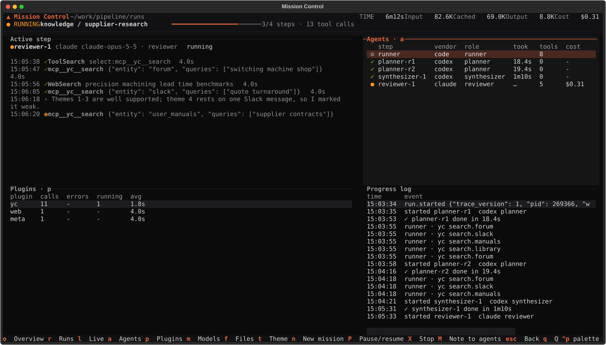
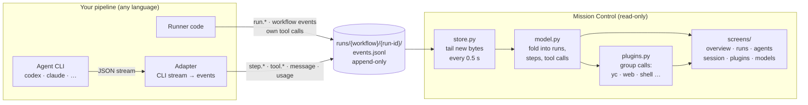
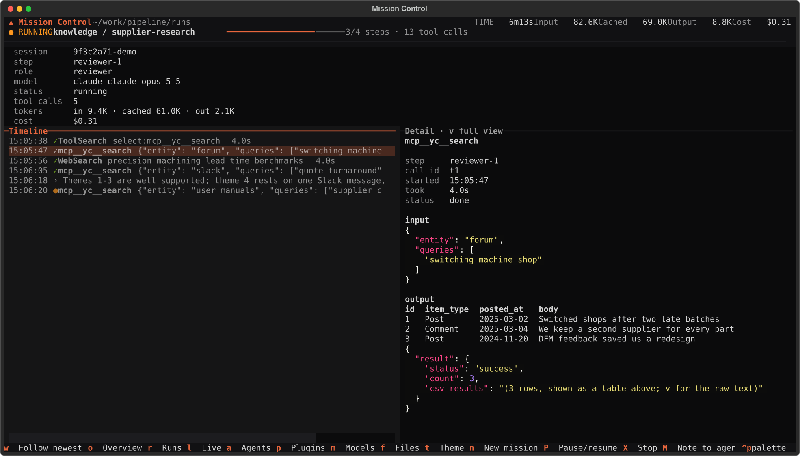
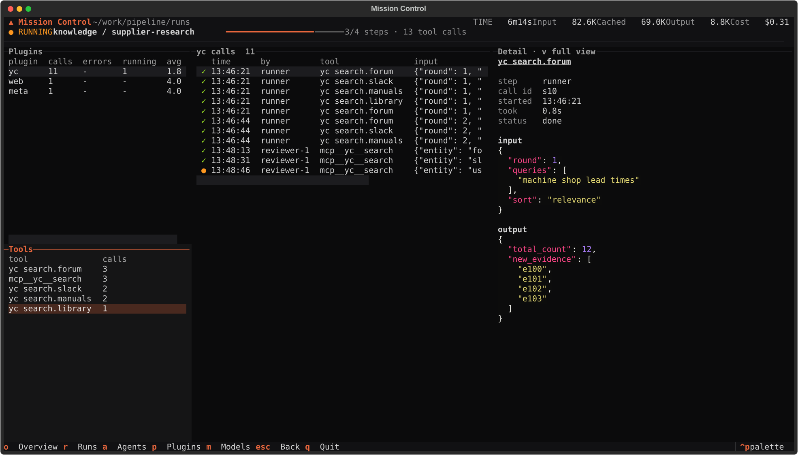
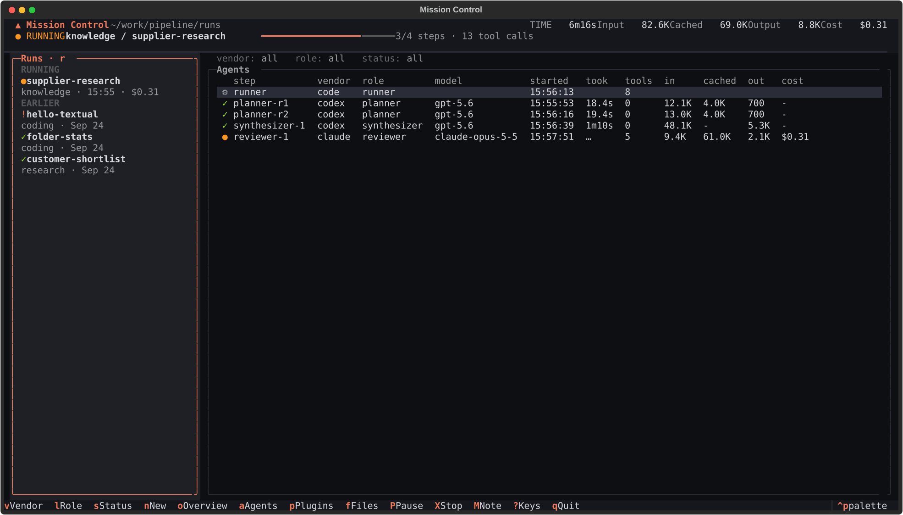

# Mission Control

**A terminal mission control for multi-agent pipelines.** Watch every agent step, tool
call, message, prompt, token and dollar of a run *as it happens*, whichever agent CLI
(Codex, Claude, …) or plain code made it.



Mission Control is read-only and pipeline-agnostic: it follows trace files
(`<runs>/<workflow>/<run-id>/events.jsonl`) that your pipeline appends to, and never
imports your code. Anything that writes the [trace format](docs/trace-format.md), in any
language, shows up.

## How it works



The trace file is the only contract. Your pipeline appends events as they happen;
Mission Control reads only the new bytes on each poll, folds them into a model of the
run, and tells the visible screen what changed. Neither side imports the other, so
either can change or crash without breaking the other.

## Why

Multi-agent pipelines are hard to see into. Logs scroll past, each agent CLI streams its
own JSON dialect, and the interesting part (which tool was called, with what, what came
back, what it cost) is buried. Mission Control turns one simple event file per run into
a set of screens you drive with single keys, live.

## Install

Requires Python 3.12+ and [uv](https://docs.astral.sh/uv/).

```bash
uv tool install git+https://github.com/Ashwani1330/mission-control
mission-control path/to/runs
```

Or from a clone, with your edits applying immediately:

```bash
git clone git@github.com:Ashwani1330/mission-control.git
cd mission-control
uv tool install -e .
```

Run it in a second terminal while your pipeline runs. It picks up new runs and new
events every half second.

## Screens

One screen per question, one key each. `esc` goes back, `q` quits, and the bar at the
bottom always lists the keys that work where you are.

| Key | Screen | Answers |
|---|---|---|
| `o` | **Overview** | How is this run going? Active step and its latest calls, agents, plugins, progress log. |
| `r` | **Runs** | Which runs exist? Newest first, with result and cost; `enter` selects one. |
| `a` | **Agents** | Who did what? Every step with vendor, role, model, time, tokens and cost, plus the runner's own work. `v` / `l` / `s` filter by vendor / role / status. |
| `enter` | **Session** | What exactly happened in one step? Prompt to result, every message and tool call with full input and output. `f` follows the newest. |
| `p` | **Plugins** | Which tools were used, and how? Calls grouped by plugin (yc, web, shell, skills, files) and by tool. |
| `m` | **Models** | Which model did each role run on, declared and actual? |

In any detail pane, `v` opens the full text (prompts and outputs can be large; the
preview shows the first lines).

| Session | Plugins |
|---|---|
|  |  |



## Feeding it: the trace format

One JSON object per line, appended as things happen. A handful of event names carry
meaning; anything else is shown as-is, which is how a workflow adds its own events.

```jsonl
{"time": "2026-09-25T12:00:00+00:00", "event": "run.started", "trace_version": 1, "pid": 4242, "workflow": "research", "models": {"planner": {"vendor": "codex", "model": "gpt-5.6"}}}
{"time": "2026-09-25T12:00:01+00:00", "event": "step.started", "step": "planner-r1", "role": "planner", "vendor": "codex", "model": "gpt-5.6"}
{"time": "2026-09-25T12:00:04+00:00", "event": "tool.started", "step": "planner-r1", "call_id": "c1", "tool": "shell", "input": {"command": "yc tools list"}}
{"time": "2026-09-25T12:00:05+00:00", "event": "tool.completed", "step": "planner-r1", "call_id": "c1", "tool": "shell", "output": "…"}
{"time": "2026-09-25T12:00:20+00:00", "event": "step.completed", "step": "planner-r1", "seconds": 19.2, "input_tokens": 11200, "output_tokens": 700}
{"time": "2026-09-25T12:00:21+00:00", "event": "feature.decision", "decision": "PASS"}
{"time": "2026-09-25T12:09:00+00:00", "event": "run.completed", "verdict": "PASS"}
```

- `step` ties an event to one agent call; without it, the event belongs to the run (a
  tool call without a step was made by the runner's own code).
- `tool.started` / `tool.completed` pair up by `call_id`.
- `run.started` carries the runner's `pid`, so a run whose process died shows as crashed.

The full list is in [docs/trace-format.md](docs/trace-format.md). A minimal Python writer:

```python
import json, os, threading
from datetime import datetime, timezone

class Trace:
    def __init__(self, run_dir):
        self.path, self._lock = run_dir / "events.jsonl", threading.Lock()

    def emit(self, event, **fields):
        line = json.dumps({"time": datetime.now(timezone.utc).isoformat(), "event": event, **fields})
        with self._lock, self.path.open("a") as f:
            f.write(line + "\n")

trace = Trace(run_dir)
trace.emit("run.started", trace_version=1, pid=os.getpid(), workflow="research")
```

To get tool calls from inside an agent, translate its CLI's stream (for example
`codex exec --json` or `claude -p --output-format stream-json`) into `tool.*`,
`message` and `usage` events as lines arrive.

## Plugins

A plugin is a rule in [`mission_control/plugins.py`](mission_control/plugins.py): a
name, tool-name patterns, and optionally a program that counts when an agent runs it
from a shell. So `mcp__yc__search`, a runner's `yc search.companies` and an agent's
`yc tools list` in a shell all land under **yc**, and you can compare how the MCP
server and the CLI were used. Add a plugin by adding one line.

## Develop

```bash
uv sync
uv run pytest
uv run ruff check .
uv run mission-control path/to/runs
```

```
mission_control/
  model.py     fold trace events into runs, steps and tool calls (no Textual)
  plugins.py   group tool calls into plugins (no Textual)
  store.py     find runs; tail each trace from a byte offset
  fmt.py       text formatting shared by every screen
  widgets.py   header, table syncing, timeline tree, detail pane, full-text viewer
  screens/     one module per screen, on a shared View base
  app.py       modes, polling, navigation, theme
tests/         model, plugin, tail and app tests on generated traces
docs/          the trace format; screenshots (made from synthetic data)
```

Design rules: the data model knows nothing about Textual; screens only turn the model
into rows; the app owns polling and tells the visible screen what changed.

## Roadmap

From observer to mission control, one step at a time:

1. **Observe** (now): live, read-only screens.
2. **Launch**: start a pipeline run from Mission Control.
3. **Steer**: pause and stop between steps, through a small control file the runner reads.
4. **Redirect**: send a note that the next step's prompt includes.

## License

[MIT](LICENSE)
