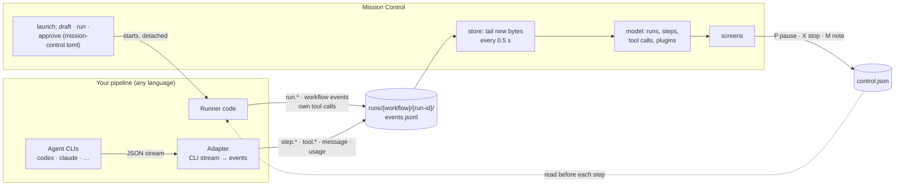
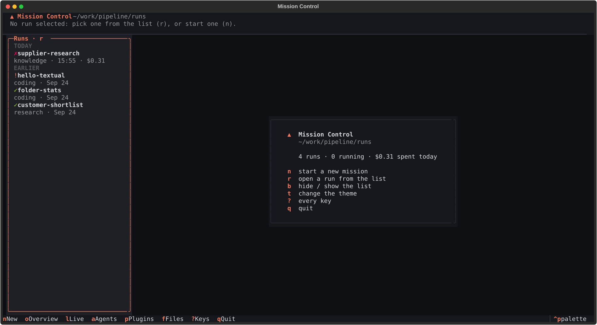
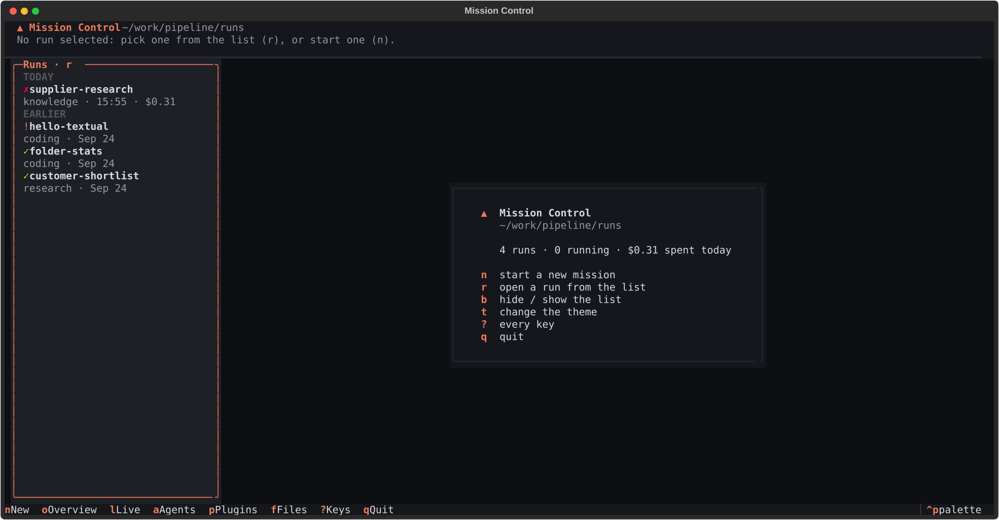
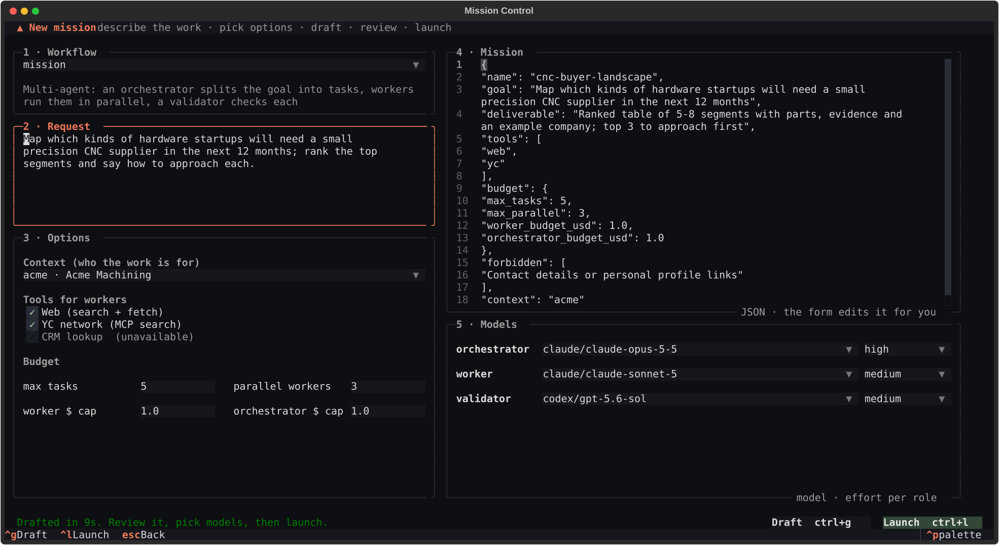

# Mission Control

**A terminal mission control for multi-agent pipelines.** Describe a mission in plain
words, pick the tools and a model for each role, launch it, and watch every agent step,
tool call, message, token and dollar *as it happens*. Pause it, stop it, send the agents
a note, approve a plan that waits for you, and browse what it produced, whichever agent
CLI (Codex, Claude, …) or plain code does the work.


## At a glance

- **Launch** missions from a request: a drafting agent writes the mission, a form sets the
  context, tools, budget and a model per role, and the run starts detached.
- **Watch** live: an overview, one tile per agent, every step's session from prompt to
  result, tool calls grouped by plugin (e.g. yc CLI vs yc MCP), models, and the run's files.
- **Steer**: pause, stop or send a note between steps; approve runs that wait for you.
- **Any pipeline**: Mission Control reads one append-only trace file per run and never
  imports your code. Anything that writes the [trace format](docs/trace-format.md), in
  any language, shows up.

## How it works



Three small contracts, all files: the **trace** your pipeline appends to, the
**control file** Mission Control writes to steer a run, and **`mission-control.toml`**,
which tells Mission Control how to draft, start and approve your workflows. Neither side
imports the other, so either can change or crash without breaking the other.

## Install

Requires Python 3.12+ and [uv](https://docs.astral.sh/uv/).

```bash
uv tool install git+https://github.com/Ashwani1330/mission-control
```

Or from a clone, with your edits applying immediately:

```bash
git clone git@github.com:Ashwani1330/mission-control.git
cd mission-control
uv tool install -e .
```

## Quick start

```bash
mission-control path/to/runs            # runs/<workflow>/<run-id>/events.jsonl
```

It opens on **Home** (or straight on a run that is live), with every run in the list on
the left. To watch a pipeline you start yourself, just run it; its run appears within
half a second. To start missions from Mission Control, add a
[`mission-control.toml`](#launching-approving-and-steering) and press `n`.



## Screens

A **run list** sits on the left of every screen, like the chat list in an LLM app:
**Running**, **Needs you** (waiting for your approval), **Today**, **Earlier**. Pick a run
and every screen shows it; `r` jumps to the list, `b` hides it. One key per screen; `esc`
goes back (to Home from the overview), `?` lists every key, `q` quits.

| Key | Screen | Answers |
|---|---|---|
| `o` | **Overview** | How is this run going? Active step and its latest calls, agents, plugins, progress log. |
| `l` | **Live** | What is every agent doing right now? One tile per agent, running ones first; `enter` opens a tile. |
| `a` | **Agents** | Who did what? Every step with vendor, role, model, time, tokens and cost, plus the runner's own work. `v` / `l` / `s` filter by vendor / role / status. |
| `enter` | **Session** | What exactly happened in one step? Prompt to result, every message and tool call with full input and output; `w` follows the newest. |
| `p` | **Plugins** | Which tools were used, and how? Calls grouped by plugin (yc, web, shell, skills, files) and by tool. |
| `m` | **Models** | Which model did each role run on, declared and actual? |
| `f` | **Files** | What did the run produce? The run folder as a tree; Markdown rendered, JSON pretty-printed; `e` opens a file in your editor. |
| `n` | **New mission** | Start one (below). |

In any detail pane, `v` opens the full text; previews show the first lines so large
prompts and outputs stay fast. `t` switches the theme (dark, dusk, light; remembered).

| Session | Plugins |
|---|---|
|  |  |

| Live agents | Every agent step |
|---|---|
|  |  |

## Launching, approving and steering



**New mission (`n`).** Pick a workflow, describe the work, set the options, `ctrl+g` to
have the workflow's drafting agent write the mission, review or edit it, pick a model and
effort per role, `ctrl+l` to launch. The run starts detached (it keeps going if you quit)
and opens as soon as its trace appears; a runner that exits before starting is reported
with its log.

**Approve (`A`).** A run that stops for a human decision (e.g. a coding plan) is listed
under **Needs you** and its header says so. Review its files under `f`; `A` (after a
confirmation) continues it in the same run folder.

**Steer (`P`, `X`, `M`).** Pause or resume, stop (asks first), or send a note to the next
agent step. These write `<run-dir>/control.json`, which a runner reads before each agent
step; the header shows *PAUSING* / *STOPPING* until it gets there. The keys appear only
while the selected run is live.

**Configure it** with a `mission-control.toml` next to your runs folder (or in the working
directory, or pass `--config`). Commands run in the config's folder.

```toml
[models]
choices = ["codex/gpt-5.6-sol", "claude/claude-opus-5-5", "claude/claude-sonnet-5"]

[[workflow]]
name = "report"
description = "Research a question with a team of agents"
run = ["python3", "-m", "pipeline.report", "{mission}"]                  # required
draft = ["python3", "-m", "pipeline.report", "--draft", "{request}", "--out", "{mission}", "--context", "{context}"]
describe = ["python3", "-m", "pipeline.report", "--describe"]            # the New mission form

[[workflow]]
name = "build"
description = "Write software: plan, you approve, then build"
run = ["python3", "-m", "pipeline.build", "plan", "{mission}"]           # ends AWAITING_APPROVAL
approve = ["python3", "-m", "pipeline.build", "run", "{run_dir}"]        # continues the same run
```

| Placeholder | Becomes |
|---|---|
| `{request}` | a file holding the request you typed |
| `{mission}` | the mission JSON file (the draft, then what you approved) |
| `{context}` | the context picked in the form |
| `{run_dir}` | the run folder being approved |

`describe` prints the options the form offers, so you never edit JSON unless you want to:

```json
{"selects": [{"field": "context", "label": "Context", "default": "acme",
              "options": [{"value": "acme", "label": "Acme Machining"}]}],
 "choices": [{"field": "tools", "label": "Tools", "options": [
              {"value": "web", "label": "Web", "available": true, "note": ""},
              {"value": "crm", "label": "CRM", "available": false, "note": "crm CLI not installed"}]}],
 "numbers": [{"path": ["budget", "max_tasks"], "label": "max tasks", "integer": true, "min": 1, "max": 8}],
 "models":  {"worker": {"vendor": "claude", "model": "claude-sonnet-5", "effort": "medium"}}}
```

Selects become dropdowns, choices checkboxes (greyed out with the note when not
available), numbers inputs with limits, models one row per role. The launched mission
carries `"models": {role: {vendor, model, effort}}`; your runner should re-check them
against its own allowlist. Drafts and launch logs go to `.mission-control/` next to the
config.

## Feeding it: the trace format

One JSON object per line, appended as things happen. A handful of event names carry
meaning; anything else is shown as-is, which is how a workflow adds its own events.

```jsonl
{"time": "2026-09-25T12:00:00+00:00", "event": "run.started", "trace_version": 1, "pid": 4242, "workflow": "report", "models": {"planner": {"vendor": "codex", "model": "gpt-5.6"}}}
{"time": "2026-09-25T12:00:01+00:00", "event": "step.started", "step": "planner-r1", "role": "planner", "vendor": "codex", "model": "gpt-5.6"}
{"time": "2026-09-25T12:00:04+00:00", "event": "tool.started", "step": "planner-r1", "call_id": "c1", "tool": "shell", "input": {"command": "yc tools list"}}
{"time": "2026-09-25T12:00:05+00:00", "event": "tool.completed", "step": "planner-r1", "call_id": "c1", "tool": "shell", "output": "…"}
{"time": "2026-09-25T12:00:20+00:00", "event": "step.completed", "step": "planner-r1", "seconds": 19.2, "input_tokens": 11200, "output_tokens": 700}
{"time": "2026-09-25T12:00:21+00:00", "event": "feature.decision", "decision": "PASS"}
{"time": "2026-09-25T12:09:00+00:00", "event": "run.completed", "verdict": "PASS"}
```

- `step` ties an event to one agent call; without it, the event belongs to the run (a
  tool call without a step was made by the runner's own code).
- `tool.started` / `tool.completed` pair up by `call_id`.
- `run.started` carries the runner's `pid`, so a run whose process died shows as crashed.
- `run.completed` with `"verdict": "AWAITING_APPROVAL"` puts the run under **Needs you**.

The full list, the control file and the approval protocol are in
[docs/trace-format.md](docs/trace-format.md). A minimal Python writer:

```python
import json, os, threading
from datetime import datetime, timezone

class Trace:
    def __init__(self, run_dir):
        self.path, self._lock = run_dir / "events.jsonl", threading.Lock()

    def emit(self, event, **fields):
        line = json.dumps({"time": datetime.now(timezone.utc).isoformat(), "event": event, **fields})
        with self._lock, self.path.open("a") as f:
            f.write(line + "\n")

trace = Trace(run_dir)
trace.emit("run.started", trace_version=1, pid=os.getpid(), workflow="report")
```

To get tool calls from inside an agent, translate its CLI's stream (for example
`codex exec --json` or `claude -p --output-format stream-json`) into `tool.*`,
`message` and `usage` events as lines arrive.

## Plugins

A plugin is a rule in [`mission_control/plugins.py`](mission_control/plugins.py): a
name, tool-name patterns, and optionally a program that counts when an agent runs it
from a shell. So `mcp__yc__search`, a runner's `yc search.companies` and an agent's
`yc tools list` in a shell all land under **yc**, and you can compare how the MCP
server and the CLI were used. Add a plugin by adding one line.

## Develop

```bash
uv sync
uv run pytest
uv run ruff check .
uv run mission-control path/to/runs
```

```
mission_control/
  model.py         fold trace events into runs, steps and tool calls (no Textual)
  plugins.py       group tool calls into plugins (no Textual)
  store.py         find runs; tail each trace from a byte offset
  launch.py        read mission-control.toml; draft, launch, approve (no Textual)
  control.py       write control.json to pause, stop or send notes
  runlist.py       the run list beside every screen
  widgets.py       header, table syncing, timeline tree, detail pane, full-text viewer
  screens/         one module per screen on a shared View base; the New mission form; dialogs
  themes.py        colour themes (settings.py remembers the choice); fmt.py shared formatting
  app.py           modes, polling, navigation, keys
tests/             model, plugin, tail, launch and app tests on generated traces
docs/              the trace format; screenshots (made from synthetic data)
```

Design rules: the data model knows nothing about Textual; screens only turn the model
into rows; the app owns polling and tells the visible screen what changed.

## Roadmap

1. **Observe**: live screens for runs, agents, sessions, plugins, models, files. Done.
2. **Launch**: start a mission from a request, with a form and a model per role. Done.
3. **Steer and approve**: pause, stop, notes, approval gates. Done.
4. **Next**: compare runs side by side; per-plugin views over time; budgets and alerts;
   redirecting a single agent.

## License

[MIT](LICENSE)
